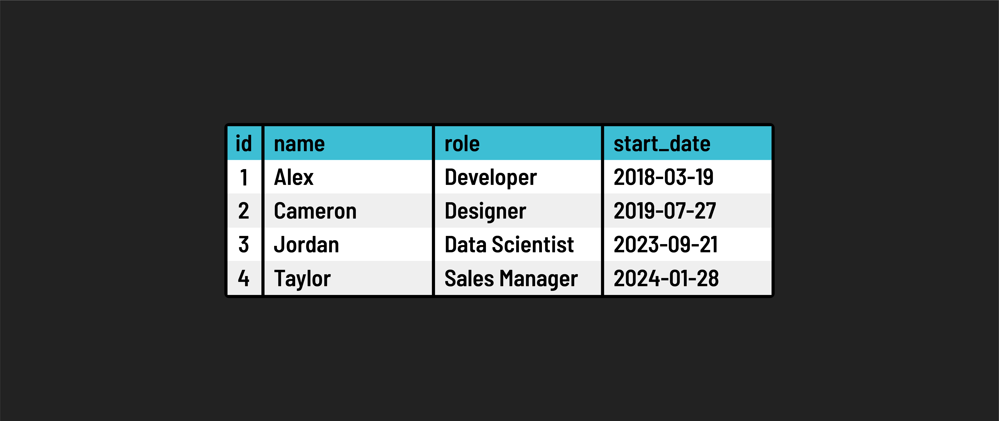

# 

## Schema

The structure of a relational database is defined by its **schema**.

It outlines various elements like:

 - **Tables:** These include specifications of columns and data types.

 - **Indexes:** These are used for faster retrieval of data.

 - **Constraints:** These are rules that ensure data integrity (such as whether a field can be null or not).

## Tables

Tables are the core components of a relational database. Here’s a simple view of what database tables might look like, similar to spreadsheets with *columns* and *rows*:

A table in a relational database holds data for a particular _data resource_, for example, employee data represented in columns like **name**, **role**, **start_date**, etc.

## Columns and rows

### Rows (Records)

A row in a table represents a single instance of the data entity.

For example, a particular **artist** is in an **artists** table.

TABLE: **artists**

| id (PK) | name           | nationality |
| ------- | -------------- | ----------- |
| 1       | Prince         | American    |
| 2       | Sir Elton John | British     |

TABLE: **songs**

| id (PK) | name                | year_released | artist_id (FK) |
| ------- | ------------------- | ------------- | -------------- |
| 1       | Tiny Dancer         | 1971          | 2              |
| 2       | Little Red Corvette | 1982          | 1              |
| 3       | Raspberry Beret     | 1985          | 1              |
| 4       | Your Song           | 1970          | 2              |

### Columns (Fields)

The columns of a table have a:

- Name
- Data type (all data in a column must be of the same type)
- Optional constraints

The typical naming convention is usually snake_cased and singular.

PostgreSQL has many [data types](https://www.postgresql.org/docs/11/datatype.html) for columns, but common ones include:

- `integer`
- `decimal`
- `varchar` (variable-length strings)
- `text` (same as `varchar`)
- `date` (does not include time)
- `timestamp` (both date and time)
- `boolean`

Typical constraints for a column include:

- `PRIMARY KEY`: column, or group of columns, uniquely identify a row
- `REFERENCES` (Foreign Key): value in a column must match the primary key in another table
- `NOT NULL`: column must have a value; it cannot be empty (null)
- `UNIQUE`: data in this column must be unique among all rows in the table

### Primary Keys (PK) and Foreign Keys (FK)

The field (or fields) that uniquely identify each row in the table are known as that table's **primary key (PK)**.

Since only one type of data entity can be held in a single table, related data, for example, the **songs** for an **artist**, are stored in separate tables and "linked" via what is known as a **foreign key (FK)**.

