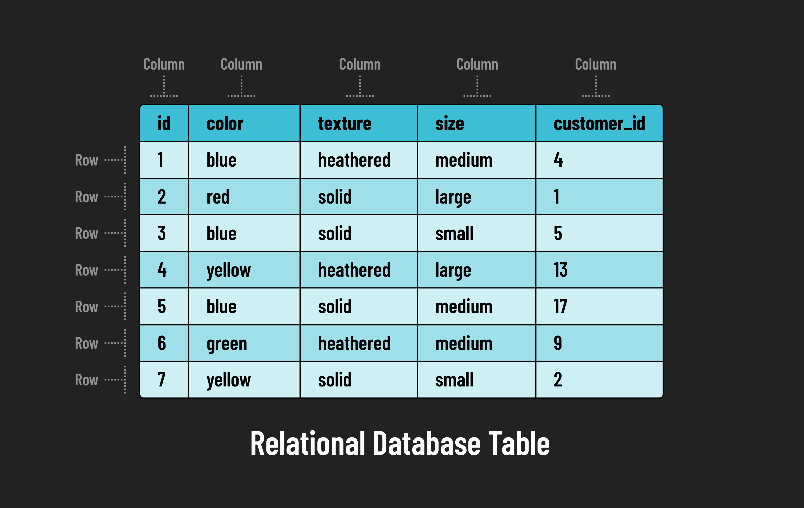

# 

**Learning objective:** By the end of this lesson, students will be able to explain the concepts of SQL and databases, with a specific focus on PostgreSQL, understanding why these skills are crucial in data management and software development.

## What is SQL?

[SQL (Structured Query Language)](https://developer.mozilla.org/en-US/docs/Glossary/SQL), often pronounced "sequel," is the standard programming language used to manage and manipulate data stored in relational databases. It features a syntax that is similar to the English language, making it accessible and easy to learn. SQL plays a critical role in data operations, allowing for effective data retrieval, insertion, updating, and deletion.

It's important to note that while SQL is standardized, its implementation can vary slightly across different Relational Database Management Systems (RDBMS). Common RDBMSs like **_SQLite_** and **_PostgreSQL_** might differ in terms of the specific SQL commands they support.

## PostgreSQL and SQL

[PostgreSQL](https://www.postgresql.org/) is an advanced open-source Relational Database Management System (RDBMS), built in 1982 at the University of California, Berkeley. It is known for its robustness and ability to handle large volumes of data, to support a wide range of SQL functionality. Throughout this module, we'll be using PostgreSQL to demonstrate SQL concepts and practices.

## Different types of databases

Databases can be categorized into several types, each with distinct features and uses. According to [DB-Engines Ranking](https://db-engines.com/en/ranking), databases are primarily classified into:

- **Relational databases:** Conceived by [E.F. Codd](https://en.wikipedia.org/wiki/Edgar_F._Codd) at IBM in 1970, these are the most popular type of database.

- **NoSQL databases:** These cater to specific data models and have flexible schemas for building modern applications.

We will be using PostgreSQL as our relational database system because it is free and flexible, allowing us to handle data securely and efficiently. It's also widely supported by a large community, making it reliable and adaptable for scaling our applications.

## Relational database structure

### Tables, rows, and columns

These are the fundamental structural components of a relational database:

- **Tables**: A table in a relational database is similar to a spreadsheet. It serves as the primary container for data and is organized into rows and columns.
- **Rows**: Each row in a table represents a unique instance or record of the entity being stored. For example, each row would represent a single employee in a table of employees.
- **Columns**: Columns define the specific attributes or fields of the data entity. For example, in a table of employees you could have columns for employee attributes such as `name`, `role`, and `start_date`. Every entry in the same column in a table must conform to the same data type. For example, every entry in the `name` column must be a string, and every entry in the `start_date` column must be a date.

Understanding the relationship between tables, rows, and columns is important for working with relational databases. These elements work together to store data in an organized and accessible manner, making relational databases a staple in large scale data management across various industries.
